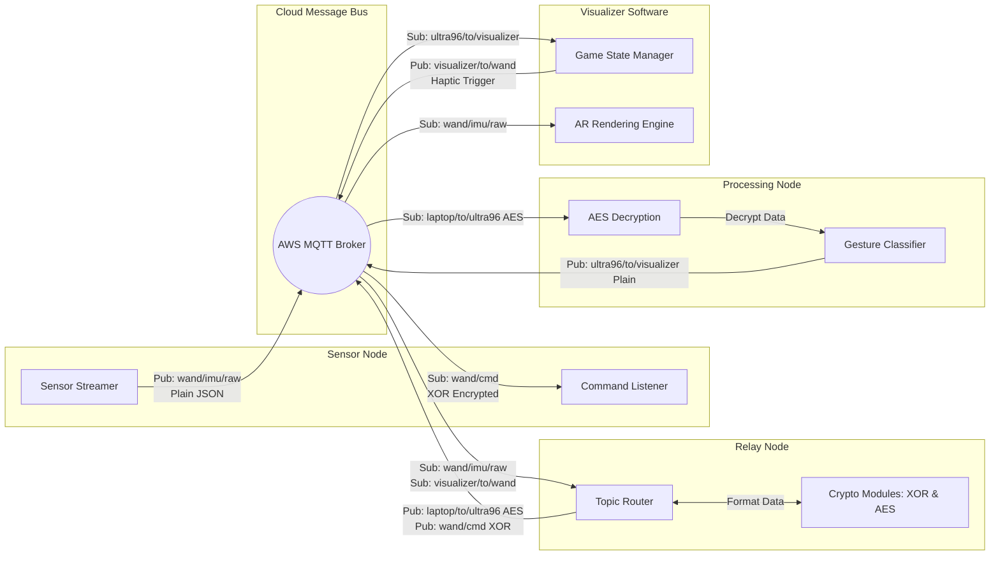
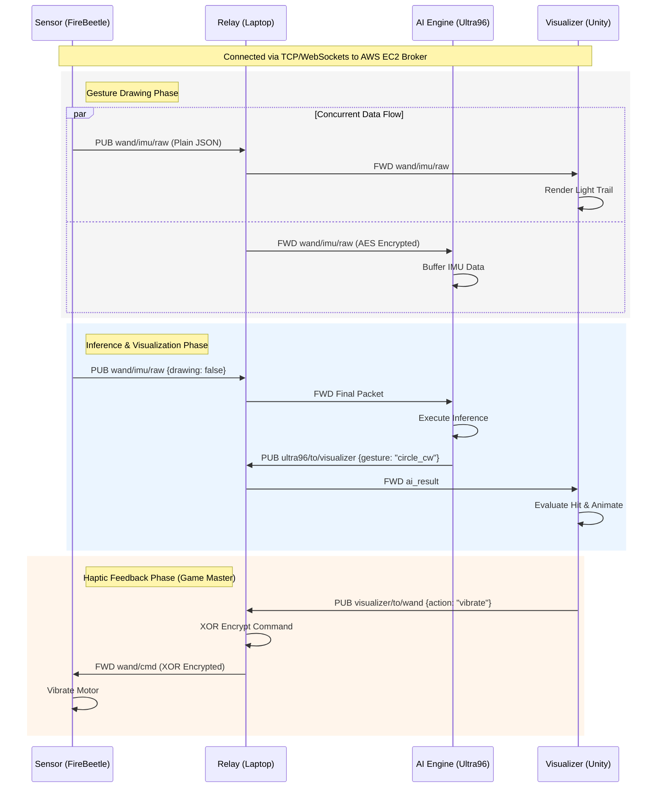

# 🪄 3D Magic Touch: AR Spell Casting 


**3D Magic Touch** is a hardware-accelerated, cloud-connected Augmented Reality (AR) game. Players wear a custom haptic-feedback glove to physically "cast spells" by drawing symbols in 3D space. An edge-AI FPGA processes the gestures in real-time to defeat virtual enemies descending in an AR environment.

---

## 🏗️ System Architecture & Data Flow

The project utilizes a **Cloud-Centric Pub/Sub Architecture** via an AWS EC2 instance. This provides total network independence, allowing the AR Visualizer to run on a 5G cellular network, the AI processing node on a restricted enterprise network, and the wearable glove on local Wi-Fi.

### Software Component Diagram


### System Sequence Diagram


### Key Features
* **True End-to-End Encryption:** Custom XOR cipher for high-frequency microcontroller streams, coupled with AES (Fernet) encryption for internet-routed AI payloads.
* **Firewall Smuggling:** Dual-port AWS routing (Ports 1883 & 8080) to bypass strict enterprise NATs without unstable reverse SSH tunnels.
* **Hardware AI Acceleration:** A custom neural network running on the Ultra96-V2 FPGA via AXI DMA for ultra-low latency inference.
* **Centralized Game Master Logic:** Unity engine dictates haptic feedback states to prevent desynchronization between digital visual effects and physical vibration motor feedback.

---

## 🧰 Hardware Requirements
* **Sensor Node:** DFRobot FireBeetle ESP32, Adafruit BNO055 Intelligent IMU, Coin Vibration Motor, 3.7V Li-Po Battery.
* **Processing Node:** Avnet Ultra96-V2 FPGA Development Board.
* **Visualizer Node:** Android Smartphone supporting Google ARCore Depth API.
* **Infrastructure:** AWS EC2 Instance (Ubuntu) or equivalent cloud VM.

---

## ⚙️ Installation & Setup

### 1. Cloud Infrastructure (AWS EC2)
1. Launch an Ubuntu EC2 instance and open TCP ports `1883`, `8080`, and `9001` in the Security Group.
2. Install the broker: `sudo apt update && sudo apt install mosquitto`
3. Edit the config `sudo nano /etc/mosquitto/conf.d/default.conf`:
```text
allow_anonymous true
listener 1883
protocol mqtt
listener 8080
protocol mqtt
listener 9001
protocol websockets
```
4. Restart the service: `sudo systemctl restart mosquitto`

### 2. Sensor Node (ESP32)
1. Open `MQTTBroker_Vibrate.ino` in the Arduino IDE.
2. Install dependencies: `AsyncMqttClient`, `ArduinoJson`, `Adafruit BNO055`.
3. Update your credentials:
```cpp
#define WIFI_SSID "YOUR_WIFI"
#define WIFI_PASSWORD "YOUR_PASS"
#define MQTT_HOST "YOUR_AWS_IP" 
```
4. Flash the firmware to the FireBeetle.

### 3. Relay Node (Laptop)
1. Ensure Python 3.8+ is installed.
2. Install dependencies: `pip install paho-mqtt cryptography numpy`
3. Open `relay_laptop.py` and update the `broker_ip` variable to match your AWS EC2 instance.
4. Ensure the `SECRET_KEY` matches the key used in the Ultra96 script.

### 4. Processing Node (Ultra96)
1. Move the `ultra96_live_actual.py` and your compiled `.bit` / `.hwh` files to the Ultra96 using Jupyter or SCP.
2. Update the `broker_ip` in the script to target your AWS EC2 instance on **Port 8080**.

### 5. Visualizer Node (Unity)
1. Open the Unity project (Unity 2022 LTS recommended).
2. Navigate to the `MQTTAdapter` script/object in the scene.
3. Update the Broker IP address and ensure the port is set to `9001` (WebSockets).
4. Build and run the `.apk` on your Android device.

---

## 🚀 Execution Order
To ensure proper handshake synchronization and avoid dropped packet buffers, boot the system in this order:

1. **Cloud Broker:** Verify the AWS EC2 instance is active.
2. **Relay Node:** Run `python3 relay_laptop.py`. Wait for the connection success message.
3. **Sensor Node:** Power on the ESP32 Glove. Confirm the 50Hz data stream appears in the relay terminal.
4. **Processing Node:** Execute `python3 ultra96_live_actual.py` on the FPGA.
5. **Visualizer Node:** Launch the Android App, strap into the neck mount, and start casting spells!

---

*Developed at the National University of Singapore (NUS).*
